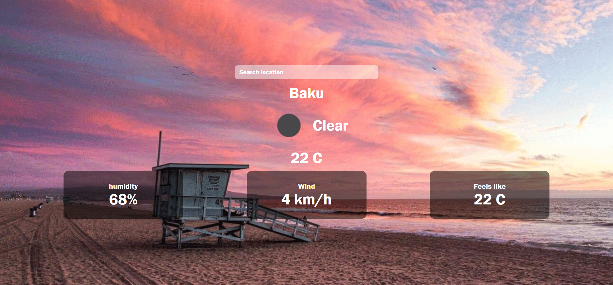

# Callback vs Promises ⚖️

### Task 1 - Weather app 🎯

The default version of project is ready. You’re going to note your own Api key inside Api. You need to sign up for [*openweathermap*](https://openweathermap.org/api) for this.

Create a site that provides the information of the weather of the city when you type the name of the city in the search bar

Dive into [*api documentaion*](https://openweathermap.org/api) and create real ***Weather app*** 🚀
### Happy Hacking

